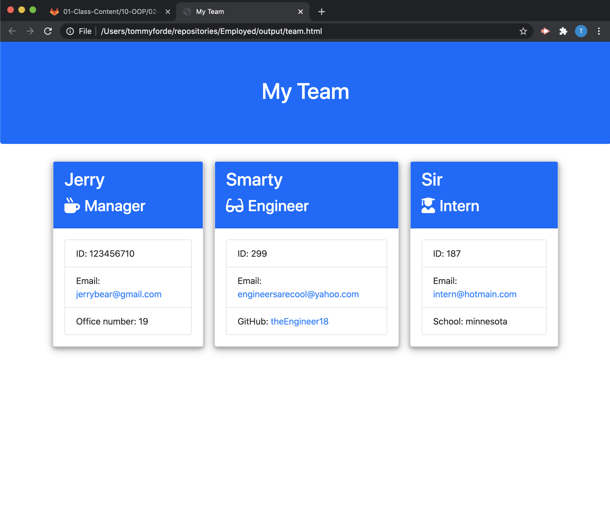
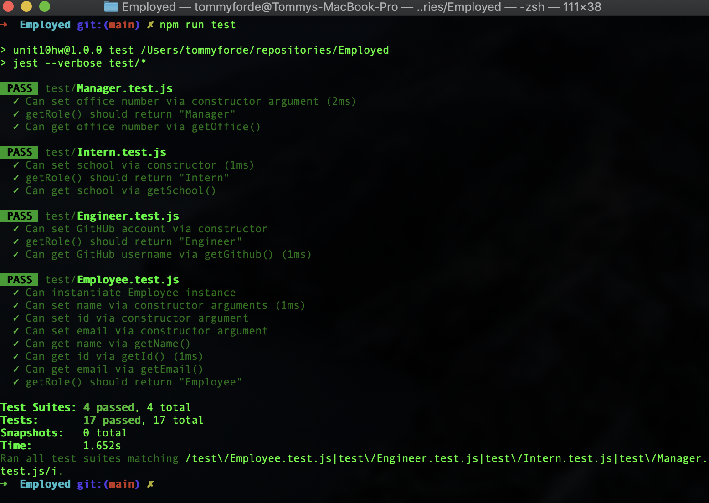

# __Employed__
### A CLI tool to manage your team. With a simple, straight forward set of questions, Employed allows you to create visual representations of your manager, engineers, and Interns. Created by Tommy Forde.

### [Github link to THIS project](https://github.com/tforde4623/Employed)

***

***

## Technologies used
 * Node.js
 * Inquirer module
 * jest testing suite
 * path (built in node module)
 * file system (fs - built in node module)

 ***

### Using jest we used tests to make sure all employee types are accurate.

***

### Difficulties - I encountered some challenges, like with all projects, as that's how you learn. The first challenges was having to think about how I would program the flow of the CLI. The first method I found seemed messy to me, being lines of if statements. So I challenged that, and created a much cleaner code, furthering my skills in promises I made it work with individualized code blocks, calling eachother asyncronously, once the questions and tasks they needed to do were accomplished.

***

#### License: None

